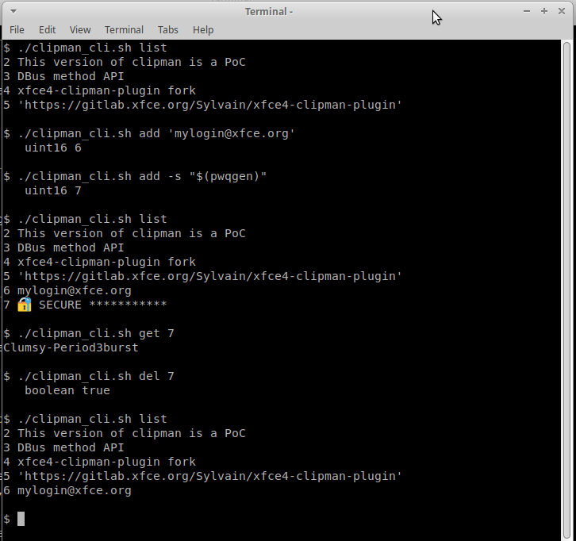

[](https://gitlab.xfce.org/panel-plugins/xfce4-clipman-plugin/-/blob/master/COPYING)

# xfce4-clipman-plugin fork

⚠️ Protoype disposable code, don't expect a fully running code.

This fork implements the concept of: Secure Item

This version of clipman is a PoC (Proof of Concept) to experiment how we could handle `secure_item`.
Secure Item are special text clipboard Item that can be deleted or obfuscated in visual GUI or via cli.

This code come from an idea discussion on the following [xfce issue #25](https://gitlab.xfce.org/panel-plugins/xfce4-clipman-plugin/-/issues/25)

We are interested in a clipman feature that would handle password copied to the clipman history in a secure maner.
Those Secure Item should not be exposed, and could be deleted automatically after a short period (30s for example).


Example of cli session



## Demo text session output

```
$ ./clipman_cli.sh list
 9 This version of clipman is a PoC
10 DBus method API
11 xfce4-clipman-plugin fork
12 'https://gitlab.xfce.org/Sylvain/xfce4-clipman-plugin'

$ ./clipman_cli.sh add 'mylogin@xfce.org'
   uint16 13

$ ./clipman_cli.sh add -s "$(pwqgen)"
   uint16 14

$ ./clipman_cli.sh list
 9 This version of clipman is a PoC
10 DBus method API
11 xfce4-clipman-plugin fork
12 'https://gitlab.xfce.org/Sylvain/xfce4-clipman-plugin'
13 mylogin@xfce.org
14 🔐 SECURE ***********

$ ./clipman_cli.sh get 14
⛔dmVudDViZWdnYXIrQWZnaGFu

$ ./clipman_cli.sh get_secure 14
vent5beggar+Afghan

$ ./clipman_cli.sh del 14
   boolean true

$ ./clipman_cli.sh list
 9 This version of clipman is a PoC
10 DBus method API
11 xfce4-clipman-plugin fork
12 'https://gitlab.xfce.org/Sylvain/xfce4-clipman-plugin'
13 mylogin@xfce.org
```

## Some context and how came the Secure Item idea

For now I'm using `pass` password manager + my own variant of dmenu shell script (was [https://git.zx2c4.com/password-store/tree/contrib/dmenu](https://git.zx2c4.com/password-store/tree/contrib/dmenu)).

But now, I use [rofi](https://github.com/davatorium/rofi) instead of `dmenu`, and I put multiple entries in the
clipboard, which is possible with a clipboard manager. But this disable the autoremoval delay in the clipboard.

Now, I'm also facing ISO 27001 certification, and I would like a more secure clipboard. And I would love to continue using clipman, too.

Here is my contribution to handle secure clipboard. Not so secure, but with some features that avoid simple disclosure.

* add a new `secure_item` type in clipman, in addition of the existing image and text item storage
* via a new command line interface, we manage the clipboard history:
  * delete an entry by ID: `xfce4-clipman-cli delete 12` (delete entry numbered 12 from history)
  * delete an entry by content: `xfce4-clipman-cli delete -c "$password_value"`
  * list entries: `xfce4-clipman-cli list` (output all text entries with id as prefix)
  * set an item of the clipman history as `secure`: `xfce4-clipman-cli secure 123` (make item number 123 as secure)
  * insert a secure item directly: `xfce4-clipman-cli add --secure "$password"` (output the new id inserted item)

History deletion could be managed outside clipman by secure storage manager,
like `pass` extension, or shell wrapper helper. So clipman don't have to handle
timestamping and timer auto deletition item itself.

At the time I started reading clipman code, there was a `xfce4-clipman-history` but
this code cannot communicate with the clipman daemon/plugin data in memory.
That was fixed by introducing a DBus API.

## DBus method API

In order to modify the clipman history, in memory, an API (IPC Interprocess Communication) has been implemented via DBus
call.

Full xml spec is in the code: [dbus-clipman-service.c](./panel-plugin/dbus-clipman-service.c)

### `list_history`

Retrieve all items in clipman history (Secure Item are hidden).

Actually returns a string. (could be a more complex DBus format, list of ClipmanHistoryItem, etc.)
Sting format is mutiple row separated be newline `\n`:

```
ID TEXT
```

### `get_item_by_id`

Get one item by its ID in clipman history. ID will be obtained by `list_history` or result of `add_item`.
You can read the Secure Item value via a`get_item_by_id` call.

Argument:
 * bool `decode_secure_text` if true, the item is revealed, else you got the encoded value
 * uint16 id of an item in the history

Returns: string

### `add_item`

Add text item to clipman history

Argument:
 * secure: boolean
 * value: string

`CLIPMAN_SECURE_TEXT_MARKER`: utf-8 symbols  Wrong way sign:  0x26d4 ⛔

If secure is true, the `value` must be encoded: "⛔" + `base64_encode(value)`

Returns: unit16 the new ID of the instered item.

### `delete_item_by_id`

Remove an item from the clipman history if the ID exists.

Argument:
 * uint16 id of an item in the history

Returns: boolean

### `clear_history`

Remove data in clipman history. All if `clear_only_secure_text` is fasle, and only Secure Item, else.

Argument:
 * `clear_only_secure_text` : boolean

Returns: uint16 number of deleted elements


## Roadmap in clipman modification

### Roadmap for this PoC

What have been done within this PoC

* ~~add remote call behavior IPC to clipman~~
* ~~ensure all the entries have permanent auto incremented ids (even when sorted or deleted)~~ draft done in the PoC
* ~~retrieve an item in the clipman history by id~~
* ~~find a way how to delete a given entry in clipman~~
* ~~add a DBus method to add item in history through DBus~~
* ~~find way to store a new `secure_item` in clipman (type: secure + text value)~~
* ~~gui change: obfuscate  `secure_item` in popup history~~
* ~~add a DBus method to clear all history~~
* ~~replace history GSList by GList (double linked list)~~
* ~~add a DBus parameter to clear all `secure_item` only~~
* ~~encode secure item in memory on DBus client side, so secure item is less exposed~~
* ~~ensure item is removed from real clipboard when deleted via DBus API~~

### More than the PoC Roadmap

Extra modification that I meet during daily usage

* add `set_secure_by_id` to change state secure of a text item
* add `secure_collect`: next item(s) copied into the clipbaord are secured by the collector
* delete an Item from the GUI menu hitting delete key
* toggle an Item in the GUI menu as Secure hitting 's' key


## How to build

Dont forget to install the lovely colored emoji font!  😀

```
sudo apt install xfce4-dev-tools libgtk-3-dev libxfce4ui-2-dev libxfce4panel-2.0-dev fonts-emojione
./autogen.sh --enable-debug
make
# prefix in /usr/local by default, so it may require sudo to work
make install
```

## Test the PoC from `xfce-test`

```
cd to/cloned/xfce4-clipman-plugin
xfce-test start
```

You can compile the code with the instruction above, from outside or from inside the docker container.

The following step are done within xfce-test session:

Install required package inside docker instance (will be lost on exit)

```
sudo apt update -y
sudo apt install -y xfce4-dev-tools libgtk-3-dev libxfce4ui-2-dev libxfce4panel-2.0-dev fonts-emojione passwdqc pass
```

setup a GPG key for passwordstore

```
gpg --quick-generate-key text@xfce.org
# answer question and set a passphrase
# grab the generated key ID

# initialize passwordstore with the gpg key ID
pass init $gpg_generated_key_above
```

add some entries into passwordstore
```
pass generate example1
pass generate example2
```

run clipman
```
./panel-plugin/xfce4-clipman
```

Open another terminal to interract with cli.

get a passwordstore entry via a small shell demo wrapper:

```
./pass_clip.sh example2
```

play with DBus clipman shell wrapper

```
cd ./panel-plugin/
./demo.sh
```

etc.


## Xfce dev question

* What signal to emmit when item are removed?
* How to map delete key, so we can delete an Item from the menu
* What is the dbus: session bus: org.xfce.clipman?
