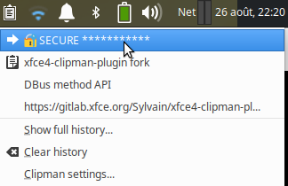

[](https://gitlab.xfce.org/panel-plugins/xfce4-clipman-plugin/-/blob/master/COPYING)

# xfce4-clipman-plugin fork

⚠️ Protoype disposable code. This code may crash, and all secure aspect are not covered.
The purpose is only to demonstrate some possible usage.

## About this code

This fork implements the concept of: **Secure Text**

This branch of clipman is a PoC (Proof of Concept) to experiment how we could handle `SECURE_TEXT`.
Secure Text are special text clipboard Item that can be deleted or obfuscated in visual GUI or via
Command Line Interface (cli). The `clipman_cli` introduces IPC (InterProcess Communication) to talk
to Clipman daemon/panel-plugin.

This code come from an idea, from the following discussion on
[Clipman issue #25](https://gitlab.xfce.org/panel-plugins/xfce4-clipman-plugin/-/issues/25)

We are interested in a Clipman feature that would handle password copied to the Clipman's history in a secure maner.
Those Secure Text should not be exposed, and could be deleted automatically after a short period (30s for example).



## Demo text session output

Sample code in [panel-plugin/demo.sh](panel-plugin/demo.sh).

```
$ ./clipman_cli.sh list
 9 This version of clipman is a PoC
10 DBus method API
11 xfce4-clipman-plugin fork
12 'https://gitlab.xfce.org/Sylvain/xfce4-clipman-plugin'

$ ./clipman_cli.sh add 'mylogin@xfce.org'
   uint16 13

$ ./clipman_cli.sh add -s "$(pwqgen)"
   uint16 14

$ ./clipman_cli.sh list
 9 This version of clipman is a PoC
10 DBus method API
11 xfce4-clipman-plugin fork
12 'https://gitlab.xfce.org/Sylvain/xfce4-clipman-plugin'
13 mylogin@xfce.org
14 🔐 SECURE ***********

$ ./clipman_cli.sh get 14
⛔dmVudDViZWdnYXIrQWZnaGFu

$ ./clipman_cli.sh get_secure 14
vent5beggar+Afghan

$ ./clipman_cli.sh del 14
   boolean true

$ ./clipman_cli.sh list
 9 This version of clipman is a PoC
10 DBus method API
11 xfce4-clipman-plugin fork
12 'https://gitlab.xfce.org/Sylvain/xfce4-clipman-plugin'
13 mylogin@xfce.org
```

## Sample code for autoremoving `SECURE_TEXT` after 30s

More complete [passwordstore](https://www.passwordstore.org/) bash sample can be found here: [pass_clip.sh](contrib/ass_clip.sh)

```bash
DELETE_DELAY=30
# add a new secure_text and grab the new inserted ID
id=$($clipman_cli add -s "$clear_content" | awk '{print $2}')
unset clear_content
# start a backgroung task, that will delete the ID after the sleep
( sleep $DELETE_DELAY && $clipman_cli del $id; ) &
# disown let the parent shell instance to continue without waiting to its child
disown $!
```

## Some context and how came the Secure Text idea

For now I'm using `pass` (aka [passwordstore](https://www.passwordstore.org/)), a password manager + my own variant of
dmenu shell script ([https://github.com/Sylvain303/find_pass/blob/master/dmenupass_dual_clipboard.sh](https://github.com/Sylvain303/find_pass/blob/master/dmenupass_dual_clipboard.sh)).

The script above also uses [rofi](https://github.com/davatorium/rofi) instead of `dmenu`, and it puts multiple entries in the
clipboard, which is possible with a clipboard manager :wink:. But this disable the `pass` autoremoval delay of in the clipboard.

Now, I'm also facing ISO 27001 certification, and I would like a more secure clipboard. And I would love to continue using clipman, too.

Here is my contribution to handle secure clipboard. Not so secure, but with some features that avoid simple disclosure.

* add a new `SECURE_TEXT` type in clipman, in addition of the existing image and text item storage
* via a new command line interface, we could manage the clipboard history:
  * delete an entry by ID: `xfce4-clipman-cli delete 12` (delete entry numbered 12 from history)
  * delete an entry by content: `xfce4-clipman-cli delete -c "$password_value"`
  * list entries: `xfce4-clipman-cli list` (output all text entries with ID as prefix)
  * set an item of the clipman history as `secure`: `xfce4-clipman-cli secure 123` (make item number 123 as secure)
  * insert a Secure Text directly: `xfce4-clipman-cli add --secure "$password"` (output the new ID inserted item)

History deletion could be managed outside clipman by secure storage manager,
like `pass` extension, or shell wrapper helper. So clipman don't have to handle
timestamping and timer auto deletition item itself.

At the time I started reading clipman code, there was a `xfce4-clipman-history` but
this code cannot communicate with the clipman daemon/plugin data in memory.
That was fixed by introducing a D-Bus API that allows IPC.


## Clipman cli use-cases

This section describes some use case that are handled by introducing IPC/DBus + `clipman_cli` or using `secure_text`.

### use-case: `secure_text` non disclosure during remote screen sharing session

During screen sharing in a remote session, no new or previous password nor any
sensitive data, should never be available on the screen. Though, you may have
URL or some useful information in Clipman for the screen sharing meeting,
and don't want to wipe the full history.

So, sensitive information should be removed, either before entering the remote
session, wiping screens and/or clipboard history.

Or you could wish to have keystroke shortcut to do that too during the
screen-share. Of course stop sharing screen doing your sensitive tasks and
re-share is a good alternative too. Most of the time you will forgot and you
could expose sensitive data, even without noticing it. Screen recording and
screen picture will always betray your sensitive information, so information
must not be show at all cost by any tools that is historying your actions.

If you can instruct yourself to never use password on command line (which have
history), it tends to be difficult to stop using clipboard manager, when you
used too. Especially when you do a lot a sysadmin tasks, involving manipulating
dozen of credentials each day.

This also apply to direct screen viewing, above your shoulder.

### use-case: password manager security chain

Most password manager, if not all, uses clipboard to transmit and *hide*
password. Clipboard manager breaks that chain because of the item are now in
history. So we should evolve the clipboard manager to know about secure content
and not to reveal by default. As password field in browser for example.

Clipboard manager are external to clipboard programs/feature in OS/GUI
environment. Here Clipman, is continuously watching (spying) the clipboard
content. When new content arrives in the clipboard it is copied in Clipman's
history. This history has a size and item are hold in FIFO style queue. Though
reused history item can be kept in the history longer than others.

The way an item enters in Clipman was only from watching clipboard content.
There's no way to make distinction on the common text and sensitive text
entering the clipboard. Item in clipboard has mime type though.

One way to achieve the chain to be maintained, from Password manager to Clipman
is to produce a way to feed Clipman directly with the sensible information. So
Clipman will take care of hiding it and much more.

IPC from Password manager to Clipman could be achieved in many way. One way is to provide cli helper on Clipman side, so
the Password manager can change his path for pushing the password in to clipboard to push it to Clipman directly.

IPC is achieved within Climap code, the external programs such as Password manager don't have to implement more than
calling cli code.

Example of using passwordstore Password manager are provided in [`pass_clip.sh`](contrib//pass_clip.sh)
and see also [xfce-test tasting session section below](README_secure_item_dbus.md#test-the-poc-from-xfce-test)

### use-case: secure collect

A password could be pushed into the clipboard from a web interface (via your web browser) that you can't control. A cloud
provider for example, generating credential. In that case, path of using `clipman_cli add -a "sensitive data"` isn't
possible. Becase the data as already enterd into the clipboard as clear text, and consequenltly in Clipman's too.

But as Clipman is watching our clipboard, a single key stroke could inform Clipman that the next item that
will enter the clipboard must be secured.

* `clipman_cli collect_secure` instructs Clipman to transform one next item into `secure_text`
* external programm push its content to clipboard
* Clipman detect the change in clipboard and secure the item immediately into its history (plus some safe cleanup
  arround like remove selection clipboard or such)

Other probable input could be a manual copy from: a teminal, log file, private messaging, burn after reading message, etc.

We made a raw example using a [`rofi_menu.sh`](contrib/rofi_menu.sh) See `use-case: hacking clipboard history`

### use-case: hacking clipboard history

The benefit of having a Clipman cli cloud also brings more interesting feature, beyond or related to `secure_text`.

For example, if you bind `F9` a new keyboard shortcut for changing clipman behavior, on the fly, to [`rofi_menu.sh`](contrib/rofi_menu.sh).
You could run it from command line directly too.

`rofi` is Quick and dirty way, to have a custom graphical menu on a single keystroke, for those who don't do GUI programming. :wink:

This script give 3 choices:

```shell
🔐 secure next copy
⚙️ html black box
🗑️ clear secure items
```

The purpose of this script is just to show some sample on how to hack into clipman with IPC support via `clipman_cli`.

An example has been produced too: "wrapping a HTML content into a HTML <table>". [transform_clipboard](contrib/transform_clipboard.py)

This use-case happen to me: `xfce-terminal` as a right-click feature which is `Copy as HTML`. Which nicely transforms the
selection into somewhat reproducing the actual coloring displayed on the terminal. But the generted HTML text is not
suitable for direct paste to a mail client such Thunderbird for example.

Though, Clipman have action, they are triggered by regular expression matching. Here the HTML text could by anything so
can't be applyed to all HTML like clipboard content. It permits external script to manipulate Clipman history on single key
prior to the copy.

* hit `F9` run `rofi_menu.sh`
* select `html black box` + enter
* `rofi_menu.sh` continues watching clipboard though `clipman_cli` and will change it on the fly
  * transform last entry and replace (delete + add) a new content

etc.

## Roadmap in clipman modification

### Changes done this PoC

First minimal changes done in clipman code (git tag `poc_finished`)

* ~~add remote call behavior IPC to clipman~~
* ~~ensure all the entries have permanent auto incremented IDs (even when sorted or deleted)~~ draft done in the PoC
* ~~retrieve an item in the clipman history by ID~~
* ~~find a way how to delete a given entry in clipman~~
* ~~add a D-Bus method to add item in history through cli~~
* ~~find way to store a new `SECURE_TEXT` in clipman (type: secure + text value)~~
* ~~gui change: obfuscate  `SECURE_TEXT` in popup history~~
* ~~add a D-Bus method to clear all history~~
* ~~replace history GSList by GList (double linked list)~~ optional for the PoC but more efficient for deletion
* ~~add a D-Bus parameter to clear all `SECURE_TEXT` only~~
* ~~encode secure item in memory on D-Bus client side, so Secure Text is less exposed~~
* ~~ensure item is removed from real clipboard when deleted via D-Bus API~~ (only for Secure Text, though)

### More than the PoC Roadmap

Extra modification that I met during daily usage

* ~~add `set_secure_by_id` to change state secure of a text item~~
* ~~add `secure_collect`: next item(s) copied into the clipbaord are secured by the collector~~
* ~~delete an Item from the GUI menu hitting delete key~~
* ~~toggle an Item in the GUI menu as Secure hitting 's' key~~ `S` key was bound to popup xfce4-clipman-history which is now `H`
* replace `clipman_cli` with c code and decode `secure_text` only on client side
* handle error connecting to x11 in clipman cli or external helper? :
```
Error org.freedesktop.D-Bus.Error.NoReply: Did not receive a reply. Possible
causes include: the remote application did not send a reply, the message bus
security policy blocked the reply, the reply timeout expired, or the network
connection was broken.
```
* discuss about stronger encryption for Secure Text
* add deny list signature. We could avoid some signature (checksum) to be collected at all, or only as Secure Text.
* Search clipman history by content, `clipman_cli search_id` `clipman_cli del -c "clear_text"`
* ~~add demo/PoC `clipman_cli` (using rofi) for managing clipman remotely with keyboard shortcut (`secure_collect`,
  notify, pass trough html formater, etc.)~~


### Security concern

Some Idea that could be implemented to enforce clipman / clipbaord security

* Filter secure signature by recording SHA512 (bit huge for password?): so copied item could be automatically secured or denied from history or
  selection clipboard.
* Register crypto public key, for app  connecting to D-bus, and do strong encryption:
  * `clipman_cli` will register its public key into clipman, so returned secured content will be crypted for this key
  * that mead that an app cannot read content secured by another app.
  * all app will need to get clipman public key first, in order to send secured encrypted content
  * clipman public key is generated at startup, may be more often, and memory content re-encrypted.
  * crypted Secure Text are never saved (only in memory)
* Secure Text are not kept more than a short amount of time (30s) in the clipboard(s) as clear text, but are kept
  secured in history.
* use mime type to set text item as Secure Text in the clipboard
* look for APM / secure memory?


## How to build

### Secure Text PoC tag

The PoC was finished at some point, Code enough to experiment and share.

Use git tag `poc_finished` to fetch the initial finished working PoC to test and experiment.

### Status code is this branch

I will continue to commit in this branch. Even draft not fully wokring code.
So use it in conscience.


### Common build instructions

Don't forget to install the lovely colored emoji font!  😀

```
sudo apt install xfce4-dev-tools libgtk-3-dev libxfce4ui-2-dev libxfce4panel-2.0-dev fonts-emojione
# enagle debug for compilling
export CFLAGS=""
./autogen.sh --enable-debug=full
make
# prefix in /usr/local by default, so it may require sudo to work
make install
```


### Run

Uninstall original clipman plugin.
Run manually in a spear terminal window: `xfce4-clipman`

Only one clipman daemon can be running, and xfce4-pannel don't have to try to restard original clipman.

## Test the PoC from `xfce-test`

`xfce-test` is an software to start xfce graphical interface into a fresh docker container.

```
cd to/cloned/xfce4-clipman-plugin
xfce-test start
```

You can compile the code with the instruction above, from outside or from inside the docker container.

The following step are done within xfce-test session:

Install required package inside docker instance (will be lost on exit)

```
sudo apt update -y
sudo apt install -y xfce4-dev-tools libgtk-3-dev libxfce4ui-2-dev libxfce4panel-2.0-dev fonts-emojione passwdqc pass
```

setup a GPG key for passwordstore

```
gpg --quick-generate-key text@xfce.org
# answer question and set a passphrase
# grab the generated key ID

# initialize passwordstore with the gpg key ID
pass init $gpg_generated_key_above
```

add some entries into passwordstore
```
pass generate example1
pass generate example2
```

run clipman
```
./panel-plugin/xfce4-clipman
```

Open another terminal to interract with cli.

get a passwordstore entry via a small shell demo wrapper:

```
./contrib/pass_clip.sh example2
```

play with D-Bus clipman shell wrapper

```
cd ./panel-plugin/
./demo.sh
```

etc.


## Xfce dev question

* What signal to emmit when a single item is removed?
* What is the dbus: session bus: org.xfce.clipman?
* were to put `_clipman_history_indexes_init_array()`?

## D-Bus method API

In order to modify the clipman history, in memory, an API (IPC InterProcess Communication) has been implemented via D-Bus
call. Code comes from glib repository example: [glib/gio/tests/gdbus-example-server.c](https://gitlab.gnome.org/GNOME/glib/-/blob/2.64.6/gio/tests/gdbus-example-server.c).

Full D-Bus xml spec of our API is in the code: [dbus-clipman-service.c](./panel-plugin/dbus-clipman-service.c)

Some method are descrided here.

### `list_history`

Retrieve all items in clipman history (Secure Text are hidden).

Actually returns a string. (could be a more complex D-Bus format, list of ClipmanHistoryItem, etc.)

Sting format is mutiple row separated be newline:

```
ID TEXT  '\n'
```

### `get_item_by_id`

Get one item by its ID in clipman history. ID will be obtained by `list_history` or result of `add_item`.
You can read the decoded Secure Text value via a `get_item_by_id` call too:

Argument:
 * bool `decode_secure_text` if true, the item is revealed, else you got the encoded value
 * uint16 ID of an item in the history

Returns: string

### `add_item`

Add text item to clipman history

Argument:
 * secure: boolean
 * value: string

`CLIPMAN_SECURE_TEXT_MARKER`: utf-8 symbols  Wrong way sign:  0x26d4 ⛔

If secure is true, the `value` must be encoded: "⛔" + `base64_encode(value)`

Returns: unit16 the new ID of the instered item.

### `delete_item_by_id`

Remove an item from the clipman history if the ID exists.

Argument:
 * uint16 Id of an item in the history

Returns: boolean

### `clear_history`

Remove data in clipman history. All items if `clear_only_secure_text` is fasle, and only Secure Text, else.

Argument:
 * `clear_only_secure_text` : boolean

Returns: uint16 number of deleted elements

## remote debug gui and keyboard handler with xfce-test and gdb

TODO: document how to set ip up
